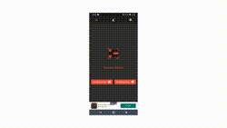

# Scanner QRCode

## Sobre o app

baixe o app 👉 
  
Esse app é um projeto feito em flutter que lê códigos de barra qr code e outros tipos de código, ele faz isso pela câmera e também pela galeria o app também constrói qr code personalizado podendo mudar as cores e formas do qr code podendo até mesmo por um logo no centro, o app tem tema claro e escuro, e possui suporte a 3 idiomas, português, inglês e chinês.

## Problemas atuais do projeto
Hoje o app cria de maneira fácil qr code para wi-fi, contatos e várias outras coisas porém quando você lê um qr code de um contato por mais que ele leia o qr code ele não abre o app de contatos já adicionando o novo contato no telefone isso acontece pq o flutter precisa se comunicar via intent para fazer todo esse processo que facilita a vida do usuário, mas usar esse tipo de intent no flutter ainda é um mistério para mim fiz muitas pesquisas e testes e o que dificulta esse processo é ser algo totalmente nativo, até achei packages que fazem isso porém na documentação não mostra como usar para esse proposito especifico.

## Testes Unitários e Testes de Widgets
Essa fase do projeto está em desenvolvimento ainda 😅, mas eu tenho um motivo pura isso principalmente relacionado a testes de widgets, eu uso um package chamado flutter_screenutil, é um ótimo package me ajudou muito a torna-lo responsivo porém ele quebra totalmente os testes e por esse motivo esse projeto ainda não tem seus testes, estou trabalhando agora na remoção dessa dependência para finalmente subir testes validos.

## Contribua com o projeto

Sinta se a vontade para contribuir com o projeto com código, issues, etc. ...

Se você quiser me apoiar nesse projeto de forma financeira o projeto possui uma versão Premium que sua única diferença é não ter anúncios, atualmente essa versão está custando R$ 1,99.

App Premium 👉 

  ##  Flutter links
- [Lab: Write your first Flutter app](https://flutter.dev/docs/get-started/codelab)
- [Cookbook: Useful Flutter samples](https://flutter.dev/docs/cookbook)

For help getting started with Flutter, view our
[online documentation](https://flutter.dev/docs), which offers tutorials,
samples, guidance on mobile development, and a full API reference.
